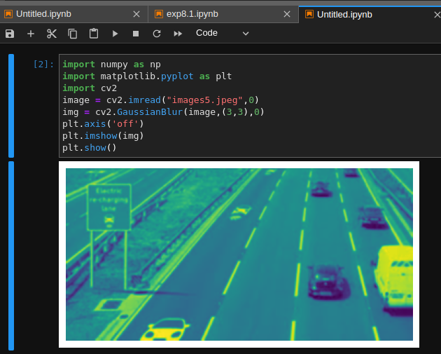
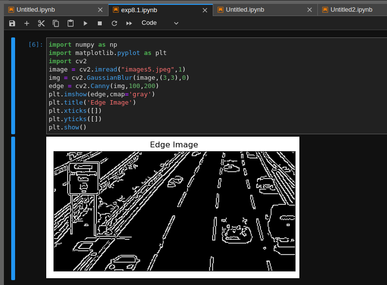
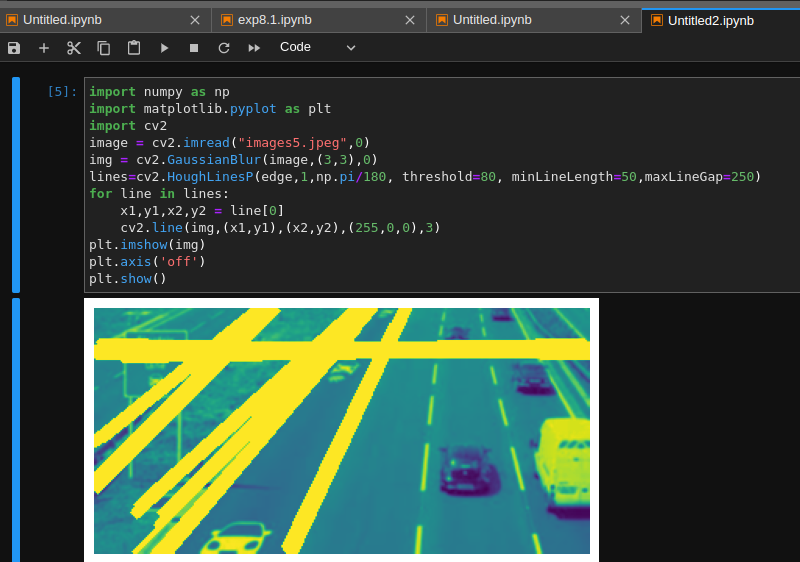

# Edge-Linking-using-Hough-Transform
## Aim:
To write a Python program to detect the lines using Hough Transform.

## Software Required:
Anaconda - Python 3.7

## Algorithm:
### Step1:
Import all the necessary modules for the program.
### Step2:
Load a image using imread() from cv2 module.
### Step3:
Convert the image to grayscale.
### Step4:
Using Canny operator from cv2,detect the edges of the image
### Step5:
Using the HoughLinesP(),detect line co-ordinates for every points in the images.Using For loop,draw the lines on the found co-ordinates.
### Step6:
Display the image and end the program.
# Program:
```Python
## Developed by : Sai Praneeth K
## Register no : 212222230067
```
## Read image and convert it to grayscale image
```python
import numpy as np
import matplotlib.pyplot as plt
import cv2
image = cv2.imread("images5.jpeg",0)
img = cv2.GaussianBlur(image,(3,3),0)
plt.axis('off')
plt.imshow(img)
plt.show()
```
## Find the edges in the image using canny detector and display
```python
import numpy as np
import matplotlib.pyplot as plt
import cv2
image = cv2.imread("images5.jpeg",1)
img = cv2.GaussianBlur(image,(3,3),0)
edge = cv2.Canny(img,100,200)
plt.imshow(edge,cmap='gray')
plt.title('Edge Image')
plt.xticks([])
plt.yticks([])
plt.show()
```
## Detect points that form a line using HoughLinesP
```python
img = cv2.GaussianBlur(image,(3,3),0)
lines=cv2.HoughLinesP(edge,1,np.pi/180, threshold=80, minLineLength=50,maxLineGap=250)
```
## Draw lines on the image
```python
for line in lines:
    x1,y1,x2,y2 = line[0]
    cv2.line(img,(x1,y1),(x2,y2),(255,0,0),3)
```

## Display the result
```python
plt.imshow(img)
plt.axis('off')
plt.show()
```
## Output

### Input image and grayscale image

### Canny Edge detector output

### Display the result of Hough transform

## Result:
Thus the program is written with python and OpenCV to detect lines using Hough transform. 
